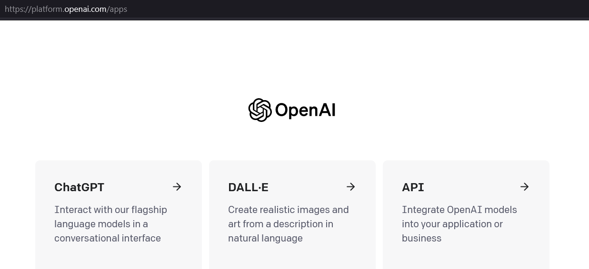
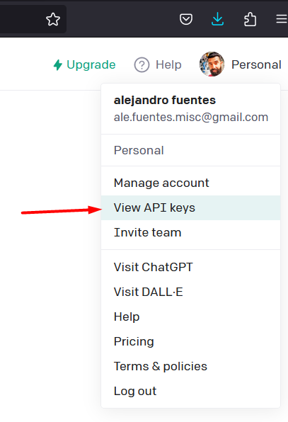
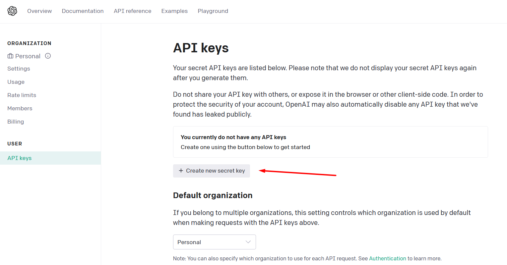
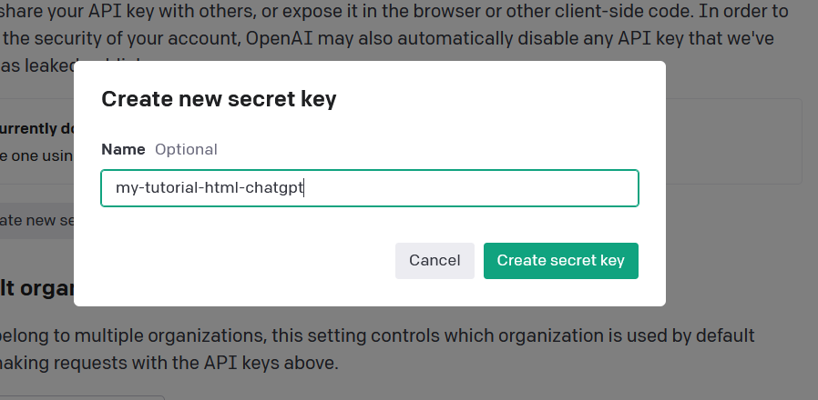

# SMALL PROJECT | HTML - CSS - JAVASCRIPT - CHATGPT

 
 
 

> **NOTE** for use this code,previusly need create the API KEY from [OpenAI][link-openai]

## How to get API-KEY of OpenIA

### **First**, go to site, and after loged, select API menu

### **Second**, from user menu, select `View API Keys`

### **Third**, select option for create our `Secret Key`

### **Fourth**, set one name, a use it

<!-- link, tools, etc -->
[link-openai]:https://openai.com/